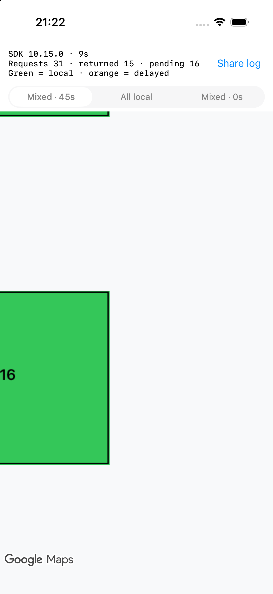
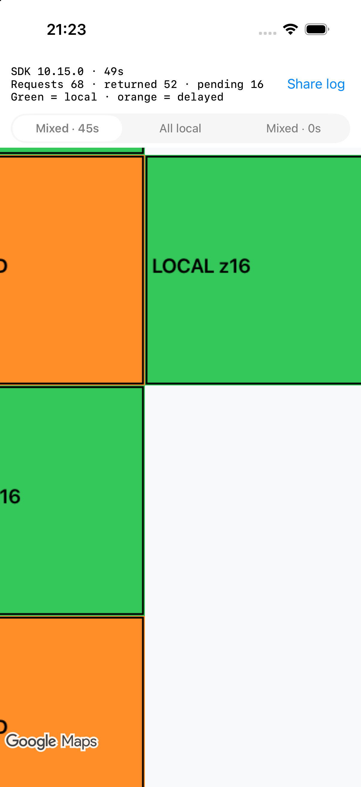
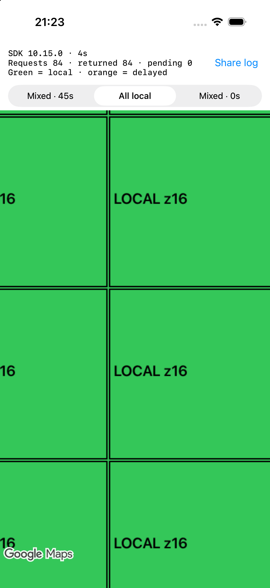
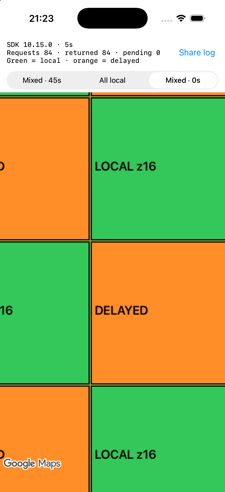

# Standalone reproduction evidence

Recorded 2026-09-28 with Xcode 27.0 (27A266a), Maps SDK 10.15.0, iPhone 17 Pro Simulator, iOS 26.5. Viewport: 402 × 710 points, screen scale 3. The SDK requested zoom 18 with the camera at zoom 16.

Each case ran in a fresh app process. Screenshot filenames indicate approximate seconds after launch; the app's elapsed time is visible in its header. Log timestamps start when each case's logger is created, before generated local tiles are written and before the map is attached.

| Case | Observation |
| --- | --- |
| Mixed, 45s | 31 requests, 15 deliveries, 16 pending before the first delayed response |
| All local | 84 requests and 84 deliveries; no pending requests |
| Mixed, 0s | 84 requests and 84 deliveries; no pending requests |

In [mixed.log](simulator-ios26.5/mixed.log), no new request was logged between the last initial `WAIT_BEGIN` at **0.696s** and the first `WAIT_END` at **45.857s**. The initial 16 pending requests refer to two zoom-16 parents (12 requests for `57980/25571`, 4 for `57980/25573`).

Sixteen local requests were issued after that first delayed completion in the recorded interval. For example:

```text
45.899 REQUEST id=38 z=18 x=231926 y=102284 parent=16/57981/25571 source=local
45.899 DELIVER id=38 z=18 x=231926 y=102284 parent=16/57981/25571 source=local pending=1
```

The sample stops recording this case at approximately 50 seconds. More missing parents are requested after the first batch, leaving another 16 delayed requests pending at that point. The screenshot demonstrates the newly visible green local region; it is not a claim that every tile has finished loading by 50 seconds.

| Waiting (about 10s) | After first delayed completions (about 50s) |
| --- | --- |
|  |  |

| All local | Mixed, immediate response |
| --- | --- |
|  |  |

Control logs: [baseline.log](simulator-ios26.5/baseline.log), [immediate.log](simulator-ios26.5/immediate.log).

These observations establish the behavior for this environment. They do not establish a documented concurrency limit or cross-layer queue sharing.

## Verification after the scene-lifecycle fix

The initial revision used the legacy app lifecycle, which caused an immediate launch crash on iOS 27 when built with Xcode 27. The crash was in `UIApplicationEvaluateRuntimeIssueForNoSceneLifecycleAdoption`, before the map was created. The app now creates its window through `UIWindowSceneDelegate` and declares a scene configuration. See [Apple's migration documentation](https://developer.apple.com/documentation/uikit/transitioning-to-the-uikit-scene-based-life-cycle).

Both device and Simulator builds passed after the change. The tile-layer implementation is unchanged.

- **Physical iPhone 17 Pro, iOS 27.0:** successfully launched, then paused at 31 requests / 15 deliveries / 16 pending. First delayed completion: 45.413s. The first subsequently requested local tile arrived at 45.425s. Sixteen local requests were issued after the first completion in the captured interval. See [device mixed.log](device-ios27.0/mixed.log). This is a real-device request log; no device screenshot is included.
- **iPhone 17 Pro Simulator, iOS 26.5:** repeated all three cases in fresh processes. Mixed again paused at 31 requests / 15 deliveries / 16 pending; baseline and immediate controls each completed 84 requests. See [mixed](simulator-ios26.5-scene/mixed.log), [baseline](simulator-ios26.5-scene/baseline.log), and [immediate](simulator-ios26.5-scene/immediate.log).
- Updated Simulator screenshots: [mixed before](simulator-ios26.5-scene/mixed-10s.png), [mixed after](simulator-ios26.5-scene/mixed-50s.png), [baseline](simulator-ios26.5-scene/baseline-5s.png), [immediate](simulator-ios26.5-scene/immediate-5s.png).

## Manual Start button

The app now waits for the bottom **Start** button. Changing the selected case also waits for Start. The button and case selector are disabled while requests remain pending.

On iPhone 17 Pro Simulator / iOS 26.5, the button was tapped through the UI after confirming the idle screen. The footer reduces the map viewport to **402 × 612 points**. This run paused at **28 requests / 12 deliveries / 16 pending**, then resumed after the first delayed completion at **45.349s**; a local request followed at **45.353s**. The change in total requests is due to the different viewport, with the same observed 16-pending pause.

See the [idle screen](start-button/ready.png), [screen after the first delayed completion](start-button/after-first-completion.png), and [request log](start-button/mixed.log). The updated app was also built, installed, and launched on the physical iPhone 17 Pro / iOS 27.0.
